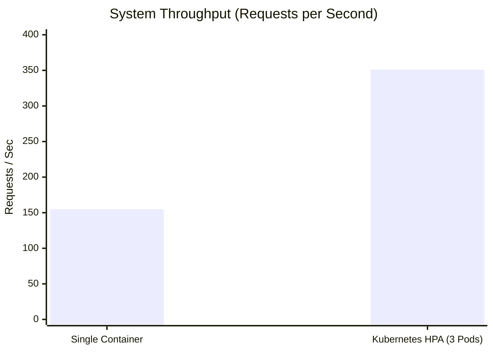
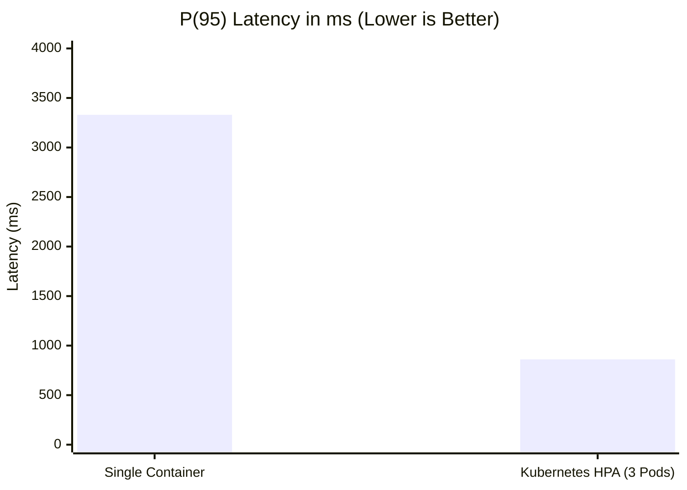

# SystemCraft

**Bridging the Gap Between Theoretical Knowledge and Practical System Design.**

System design is fundamentally an exercise in navigating trade-offs. Traditional preparation methods rely heavily on static reading materials and passive video consumption, leaving a critical gap in active, applied learning. SystemCraft was built to address this void by providing a high-fidelity, interactive environment where engineers can design, iterate, and receive objective feedback on complex system architectures.

By combining an intuitive architectural canvas with a sophisticated AI reasoning engine, SystemCraft simulates the pressures and constraints of real-world technical interviews, delivering deep insights into scalability, structural integrity, and design trade-offs.

[](./DOCKER.md)

---

## The Vision

Modern software engineering requires systems that are resilient, scalable, and highly available. Evaluating a candidate's or an engineer's ability to design such systems has traditionally required the time of senior staff. SystemCraft democratizes this process. 

Our engine evaluates architectures not just by checking boxes, but by understanding the *why* behind design decisions. It analyzes the physical connections between nodes to ensure structural soundness, while simultaneously evaluating the qualitative reasoning against industry best practices.

## Core Capabilities

- **Interactive Architectural Canvas**: A robust workspace engineered for building complex distributed systems. Users drag and drop industry-standard components (load balancers, databases, message queues) to construct their designs visually.
- **Dynamic AI Interviewer**: A simulated environment where an AI agent assumes the role of a senior engineering interviewer. It introduces live constraint changes, asks probing questions, and forces the user to adapt their architecture in real-time.
- **Hybrid Evaluation Engine**: 
  - *Structural Linter*: Deterministically scans the canvas for physical anti-patterns, such as disconnected subnets, missing redundancy, or single points of failure.
  - *Qualitative Analysis*: Powered by Google Gemini, the engine reads the architecture and the interview transcript to score the design out of 100, outlining explicit strengths, critical weaknesses, and actionable improvement steps.
- **Enterprise-Grade Observability**: A fully instrumented Prometheus and Grafana stack tracks API latency, error rates, Node.js runtime metrics, and LLM token utilization.

---

## Technical Architecture

SystemCraft is built on a modern, serverless-first stack designed for speed and reliability.

- **Frontend Application**: Next.js 15 (App Router), React 19, and Tailwind CSS 4.
- **Backend Infrastructure**: Next.js API Routes operating in a serverless environment.
- **Data Persistence**: MongoDB Atlas managed via Mongoose ODM.
- **Identity & Access Management**: Firebase Authentication supporting OAuth providers.
- **Artificial Intelligence**: Google Gemini accessed via the Google AI SDK and OpenRouter.
- **Telemetry & Monitoring**: Prometheus for time-series metric collection and Grafana for dashboard visualization.

---

## Performance & Scalability

SystemCraft is engineered to handle significant concurrent loads. We validated our architecture using `k6` load testing, simulating 500 concurrent virtual users hitting the API.

Our load testing revealed the following scaling characteristics when moving from a single container to a dynamically scaled Kubernetes cluster utilizing the Horizontal Pod Autoscaler (HPA).

### Load Test Results (500 Concurrent Users)

| Metric | Single Container | Kubernetes HPA (3 Replicas) | Improvement |
| :--- | :--- | :--- | :--- |
| **Total Requests** | 23,381 | 61,026 | **+161%** |
| **Throughput (req/s)** | ~155 req/s | ~351 req/s | **+126%** |
| **Latency p(95)** | 3.33s | 861ms | **74% Faster** |

*Note: The single Node.js instance experienced event-loop saturation at 155 req/s. By enabling Kubernetes HPA, traffic was distributed across multiple pods, drastically reducing the 95th percentile latency while more than doubling the system's throughput.*





---

## Getting Started

### Prerequisites

Ensure the following dependencies are available in your environment:
- Node.js version 20 or higher
- A provisioned MongoDB Atlas cluster
- A Firebase project with Authentication configured
- An OpenRouter API key (or direct Google AI Studio key)

### Local Development Setup

1. **Clone the Repository**
   ```bash
   git clone https://github.com/Shashank0701-byte/System-Craft.git
   cd System-Craft
   ```

2. **Install Dependencies**
   ```bash
   npm install
   ```

3. **Configure the Environment**
   Duplicate the `.env.example` file to a new file named `.env` and populate it with your specific credentials:
   ```env
   MONGODB_URL=your_mongodb_connection_string
   NEXT_PUBLIC_FIREBASE_API_KEY=your_firebase_key
   # Refer to the .env.example file for the complete list of required variables
   ```

4. **Initialize the Application**
   ```bash
   npm run dev
   ```

### Containerized Deployment

For environments requiring isolation or for production deployments, SystemCraft provides a complete Docker Compose configuration. This includes the core web application alongside the Prometheus and Grafana observability stack. 

Please refer to the [Docker Setup Guide](./DOCKER.md) for detailed instructions on containerized execution.

---

## License

This software is released under the MIT License. Please refer to the [LICENSE](LICENSE) file for complete details.

---

## Contributing

We welcome contributions from the community. To ensure a smooth integration process, please create a dedicated feature branch and submit a Pull Request for review.
